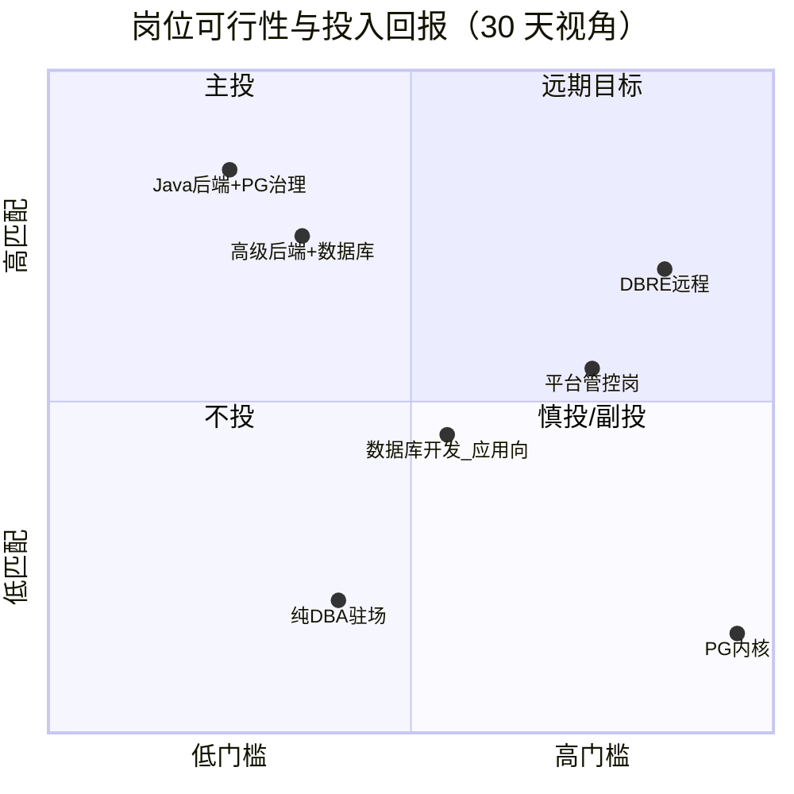

# 可行性分析

## 约束

- 前置信息：[001-what_should_I_learn.md](../001-what_should_I_learn.md)
- 针对 `PostgreSQL 深度工程（性能 + 可靠性）` 列出的所有岗位进行分析
- 需要的英语水平
- 工作地点在北京为主，远程为辐

---

## 总览结论

| 维度 | 判断 |
|------|------|
| 方向是否成立 | **成立**。缺口在「生产治理」而非「会写 SQL」，与 30 天可验证产出匹配 |
| 北京主战场 | **Java/高级后端 + PG 治理** 最现实；标题分散，需用关键词 + JD 信号筛选 |
| 30 天后可投范围 | 主投 2 类、副投 2 类；纯 DBA / 内核岗不在窗口内 |
| 英语 | 国内岗 **CET-4 读文档够用**；远程/外企 **B2 读写** 才有竞争力 |
| 最大风险 | 与「5 年 PG DBA」「内核 C 开发」岗撞车；靠作品集 + Java 年限叙事规避 |

**一句话**：30 天后以「Java 后端工程师（数据库性能/可靠性专项）」求职可行；不要把主战场放在纯 DBA、内核研发或强英语远程岗上。

---

## 岗位逐项分析

以下岗位来自 [001-what_should_I_learn.md](../001-what_should_I_learn.md) 中的目标列表，按主投 → 副投 → 慎投 → 远程增量排序。

### 1. Java 后端 + PostgreSQL / 慢查询 / 性能优化（主投）

| 项 | 内容 |
|----|------|
| 北京岗位量 | **中–高**。猎聘、Boss 上「Java + PostgreSQL」「慢查询」「性能优化」组合常年有量；SaaS、金融科技、政务数字化、出海 B2B 常见 |
| 与 30 天产出匹配度 | **高**。作品集（EXPLAIN 案例、Spring Boot 压测、连接池调参）可直接对应 JD 中的「慢 SQL 治理」「数据库性能」 |
| 与 Java 履历衔接 | **极好**。主头衔不变，PG 是加分专项，不丢弃年限 |
| 自主性 | **中–高**（团队差异大）。产品型公司、基础设施小团队常要求「与应用协作定方案」；外包 / 驻场项目低 |
| 文化 / 加班 | 产品型 SaaS、出海团队相对好；避开「大促核心 + 纯执行」描述 |
| 英语要求 | **低–中**。JD 多为中文；读 PG 官方文档、Release Notes 需 **CET-4 级阅读能力**（技术英语，非口语） |
| 典型 JD 信号（优先） | 「慢查询」「EXPLAIN」「索引设计」「连接池」「与 DBA/运维协作」「性能调优」 |
| 典型 JD 信号（避开） | 「只写业务接口、数据库不管」「MySQL 为主且无 PG 场景」 |
| 30 天后可行性 | **可投**。预期回复率高于纯 DBA；面试追问集中在 3–5 个口述题 + 作品集深挖 |
| 薪资带（北京参考） | 高级后端带 PG 专项：约 **25k–45k**（随年限与公司类型浮动，非承诺） |

**结论**：**首选主战场**。岗位真实、标题好搜、与约束集最贴合。

---

### 2. 高级后端工程师 + 数据库（主投）

| 项 | 内容 |
|----|------|
| 北京岗位量 | **高**（标题宽）。大量 JD 写「熟悉 MySQL/PostgreSQL」，需筛出**真做治理**的 |
| 与 30 天产出匹配度 | **中–高**。比「Java + 慢查询」标题更宽，竞争者也更多；靠作品集差异化 |
| 与 Java 履历衔接 | **极好** |
| 自主性 | **中**。「高级」往往含方案设计，但若 JD 只列 ORM / CRUD，自主性低 |
| 文化 / 加班 | 同第 1 类；互联网中大厂该头衔加班方差大，需看业务线（基础设施 / 平台 > 大促业务） |
| 英语要求 | **低–中**，同第 1 类 |
| 筛选要点 | JD 里除「熟悉 PG」外，需出现至少一项：**索引、事务、锁、复制、备份、监控、慢查询** |
| 30 天后可行性 | **可投**，但投递时要**改简历关键词**，把「数据库治理」放到项目经历显眼位置 |
| 风险 | 「高级」常要求 5 年+；用 Java 年限 + 专项深度对冲，勿虚报 PG 年数 |

**结论**：与第 1 类合并投递策略，简历与话术统一为「后端为主、数据库治理可验证」。

---

### 3. 数据库开发工程师 + PostgreSQL（副投）

| 项 | 内容 |
|----|------|
| 北京岗位量 | **中**。部分为**内核 / 开发**（C/C++、改 PG 源码），与「性能 + 可靠性治理」不是同一赛道 |
| 与 30 天产出匹配度 | **低–中**。若 JD 强调「内核模块」「源码级优化」「GoldenDB / 自研数据库」，**不匹配** |
| 与 Java 履历衔接 | **中**。偏数据库产品公司；Java 后台可叙事为「懂应用侧 + 懂 PG 行为」，但难对标内核岗 |
| 自主性 | 内核 / 平台研发岗自主性**高**；「数据库开发」若实为 SQL / 存储过程维护则**低** |
| 英语要求 | 内核岗偶见英文文档与社区协作，**CET-6 阅读**更稳；普通开发岗同主投 |
| 30 天后可行性 | **仅投「偏应用 + SQL 优化 + 数据建模」的 JD**；**不投**明确要求「PG 内核 5 年」「C/C++ 内核开发」 |
| 北京样例（需甄别） | 猎聘上「数据库开发专家（PG 方向）」常要求 5 年+ 内核经验——属**慎投/不投**子类 |

**结论**：作**副投且严筛**；看到「内核」「源码」「AM / WAL 模块开发」即跳过。

---

### 4. 数据库平台 / 管控平台 + PostgreSQL（副投，门槛更高）

| 项 | 内容 |
|----|------|
| 北京岗位量 | **低–中**。云厂商（阿里云 RDS、腾讯云、华为云等）、部分大厂基础设施线；北京有岗但总数少于普通后端 |
| 与 30 天产出匹配度 | **低–中**。JD 常要 K8s、管控面开发、大规模运维经验；30 天 PG 专项不足以单独够格 |
| 与 Java 履历衔接 | **中–好**。不少管控平台用 Java/Go；可叙事为「懂 PG 行为的后端，愿做平台」 |
| 自主性 | **高**（平台 / 自动化 / 减少 toil） |
| 文化 / 加班 | 云厂商平台线相对稳定；客户侧 7×24 支持岗除外 |
| 英语要求 | **中**。读 K8s / Prometheus / PG 生态英文文档；部分团队与开源社区英文 Issue |
| 30 天后可行性 | **6–12 个月后的增量目标**，非 30 天主投；可偶尔投「初级 / 后端转平台」 |
| 典型雇主 | 阿里云智能 RDS、百度数据库相关线、金融科技私有云团队 |

**结论**：方向与自主性约束一致，但**短期不作为主攻**；学习路径第 3–4 周接触的监控 / runbook 是为远期铺垫。

---

### 5. 纯 PostgreSQL DBA（慎投 / 需甄别 JD）

| 项 | 内容 |
|----|------|
| 北京岗位量 | **中**。金融、政企、传统 IT 驻场需求多 |
| 与 30 天产出匹配度 | **低**。JD 常写 **5 年+ DBA**、**7×24**、**驻场**、备份巡检 SLA |
| 与 Java 履历衔接 | **弱–中**。可强调「懂应用连接池与事务」，但 HR 筛简历时可能按「DBA 年限」硬卡 |
| 自主性 | **两极分化**。工程化 DBA（自动化、架构）高；巡检 / 工单 DBA **低**，与约束冲突 |
| 文化 / 加班 | 驻场、金融数据中心 **加班与待命概率高** |
| 英语要求 | **低**（国内金融 / 政企为主） |
| 30 天后可行性 | **不建议主投**。若 JD 写「数据库可靠性工程」「自动化运维」「与应用团队共建」可个案评估 |
| 甄别清单 | 出现「驻场」「7×24」「N 年 DBA 硬性」「只巡检备份」→ **跳过** |

**结论**：与「自主性、加班少」约束**冲突概率高**；除非 JD 明显偏工程化，否则不纳入主投列表。

---

### 6. Database Reliability Engineer / DBRE（远程 / 外企，增量）

| 项 | 内容 |
|----|------|
| 北京 / 远程岗位量 | **远程为主**；北京偶有外企研发中心，量少 |
| 与 30 天产出匹配度 | **中**（技能方向对），但雇主常要 **生产规模经验**（多集群、多区域、事故复盘） |
| 与 Java 履历衔接 | **好**。DBRE 常由后端 / SRE 转；Java + PG 治理叙事成立 |
| 自主性 | **高**（设计可靠性、自动化、减少 toil） |
| 文化 / 加班 | 外企 / 远程团队相对符合；需注意跨时区会议 |
| 英语要求 | **高**。**B2 读写**为底线：英文 JD、英文 runbook、英文事故复盘、口语面试；文档阅读 **CET-4 不够** |
| 30 天后可行性 | **6–12 个月后作增量**；30 天可把英语与作品集并行准备 |
| 典型技能栈 | PG HA（Patroni）、备份 PITR、监控告警、Terraform / Ansible、on-call 轮值（需确认强度） |

**结论**：长期目标与方向一致；**不是 30 天后的主战场**，除非英语已达 B2 且有可讲的「生产级」故事。

---

### 7. Senior Backend（JD 明确要求 PG 治理，远程 / 外企，增量）

| 项 | 内容 |
|----|------|
| 岗位量 | 出海公司、欧美远程 **中**；国内英文 JD **少** |
| 与 30 天产出匹配度 | **中–高**（技能），**低–中**（竞争与年限） |
| 英语要求 | **高**。工作内容、代码评审、文档多为英文 |
| 30 天后可行性 | 同 DBRE，作增量；作品集可投部分「Senior Backend + PostgreSQL」国内出海团队（如 base 北京、邮件英文） |

**结论**：与国内主投第 1、2 类技能重叠；差异在**语言与生产规模叙事**。

---

## 英语要求汇总

| 场景 | 阅读 | 写作 / 口语 | 建议 |
|------|------|-------------|------|
| 国内 Java 后端 + PG（主投） | PG 官方文档、邮件、Issue | 一般不要求 | **CET-4** 技术阅读即可；优先练「读文档查配置」 |
| 国内云厂商 / 平台岗（副投） | 英文文档、部分开源社区 | 偶发 | **CET-4–6** 阅读；口语非必须 |
| 远程 DBRE / 外企 Senior Backend | 日常 | 面试 + 协作 | **B2**；可 30 天内先国内投，同时练技术英语 |
| 内核 / 社区贡献向 | PG 邮件列表、源码注释 | 中 | **CET-6+** 阅读；口语看团队 |

**自评方式（不依赖考证）**：

1. 能否在 30 分钟内读完 [PostgreSQL 文档](https://www.postgresql.org/docs/current/) 某一节（如 `EXPLAIN`、`Routine Vacuuming`）并复述要点？
2. 能否用英文写一段 200 词的「慢查询优化复盘」（可先中文再译）？

两项都能做到 → 国内主投英语**不构成 blocker**；第二项吃力且目标远程 → 按 B2 准备 3–6 个月。

---

## 工作地点：北京为主，远程为辐

| 层级 | 策略 | 说明 |
|------|------|------|
| **主** | 北京 onsite / 混合 | Boss、猎聘、内推；关键词见下节 |
| **副** | 国内远程（出海团队 base 中国） | 部分岗位写「远程」但要求国内时区；英语要求高于纯国内 |
| **增量** | 国际远程 DBRE / Senior Backend | 6–12 个月；英语 B2 + 更强生产叙事 |

**北京检索关键词（建议组合使用）**：

- `Java` `PostgreSQL` / `Postgres`
- `后端` `慢查询` / `SQL优化` / `性能优化`
- `高级后端` `数据库`
- `Spring` `PostgreSQL` `连接池`
- 公司类型：`SaaS` `金融科技` `出海` `B2B`（在 JD 正文里搜）

**建议少搜或慎搜**：

- `PostgreSQL DBA` `5年`（易撞驻场 / 年限硬要求）
- `内核` `C++` `源码`（赛道不同，30 天不对口）

---

## 30 天学习窗口 vs 岗位门槛

> **读表说明**：最后一列「主投岗位是否要求」列出的是**另一类岗位**的硬性门槛，不是你这 30 天必须补齐的清单。主投「Java 后端 + PG 治理」时，该列多为 **否**——你本来就不该和这些标签竞争。

| 能力项 | 30 天可达 | 面试可验证方式 | 主投岗位是否要求 | 谁才需要这一列 |
|--------|-----------|----------------|------------------|----------------|
| 慢查询分析与索引设计 | 是 | EXPLAIN 笔记、前后对比 | **否** | 纯 DBA 岗才卡「5 年 DBA」 |
| 连接池 / 事务 / 锁 | 是 | 压测仓库、参数对比 | **否** | 大规模集群 SRE / 平台岗 |
| 复制 / 备份 / PITR 概念 | 是（实验环境） | runbook 口述 + 文档 | **否** | on-call 负责人 / 资深 DBA |
| Patroni / K8s 生产 HA | 部分（本地实验） | 架构图 + 演练记录 | **否** | 云厂商内核 / 管控岗 |
| PG 内核 C 开发 | 否 | — | **否** | 内核研发 JD（本方向不投） |

---

## 风险与对策

| 风险 | 对策 |
|------|------|
| JD 写「熟悉 PG」但实际只用 MySQL | 面试问：生产 PG 版本、最大表量级、是否用 `pg_stat_statements` |
| HR 按「DBA 年限」筛简历 | 主投「后端」头衔；简历写「Java 后端（数据库性能专项）」 |
| 作品集被认为「玩具环境」 | 压测写清数据量、并发、指标；对比「优化前 / 后」数字 |
| 与内核岗候选人同台 | 不投内核 JD；强调应用侧 + 治理闭环 |
| 北京岗少 / 标题分散 | 扩大关键词；第 3 周起每周投 5–10 个，用回复率校准 JD |

---

## 最终建议（对应父文档「下一步」）

1. **确认主战场**：国内 **Java / 高级后端 + PG 治理**；平台岗、DBRE 为 6–12 个月增量。
2. **英语**：国内主投以 **读 PG 官方文档** 为近期目标；不强行上 B2，除非同步瞄准远程。
3. **投递节奏**：第 3 周起投递；前 2 周产出 2 个 EXPLAIN 案例 + 压测 v1，避免空窗叙事。
4. **下一步文档**：阅读 [002-career-outlook.md](./002-career-outlook.md)（前景与路线），再执行 [003-week-plan.md](./003-week-plan.md)。

---

## 附录：岗位 × 约束符合度速查

| 岗位 | 紧缺 | 少人愿学 | 北京量 | 自主性 | 30天可投 | 英语 | 综合 |
|------|------|----------|--------|--------|----------|------|------|
| Java 后端 + PG 治理 | ✓ | ✓ | 中–高 | 中–高 | **是** | 低–中 | **A** |
| 高级后端 + 数据库 | ✓ | 部分 | 高 | 中 | **是** | 低–中 | **A** |
| 数据库开发（应用向） | 中 | 部分 | 中 | 中 | 筛后 | 低–中 | B |
| 平台 / 管控 | ✓ | ✓ | 低–中 | 高 | 增量 | 中 | B+（远期） |
| 纯 DBA 驻场 | 中 | 否 | 中 | 低 | 否 | 低 | D |
| DBRE / 外企 Senior | ✓ | ✓ | 低（远程） | 高 | 增量 | 高 | B+（远期） |
| PG 内核研发 | ✓ | ✓ | 低–中 | 高 | **否** | 中–高 | C（赛道不同） |
