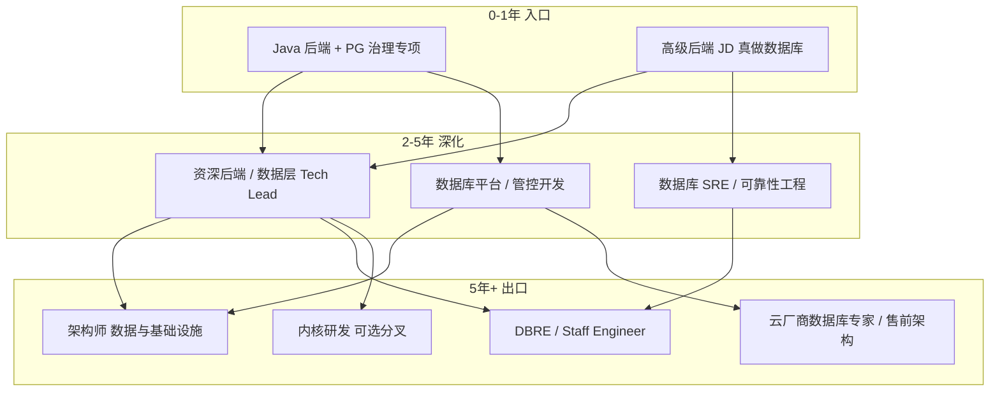

# 职业发展前景与 AI 不可替代性

## 前置与链接

- 方向与约束：[001-what_should_I_learn.md](../001-what_should_I_learn.md)
- 可行性分析：[001-can_it_works.md](./001-can_it_works.md)
- 执行计划：[003-week-plan.md](./003-week-plan.md)
- 分析对象：`PostgreSQL 深度工程（性能 + 可靠性）` 方向下，[001-can_it_works.md](./001-can_it_works.md) 所列全部岗位类型

---

## 总览结论

| 维度 | 判断 |
|------|------|
| 中长期需求 | **稳定偏强**。数据量、合规、成本压力推动「治理」需求；PG 在国内渗透率持续上升 |
| 职业天花板 | **高**。可从「后端 + 专项」走到平台架构、可靠性负责人、技术专家；不必锁死在 DBA 头衔 |
| 薪资曲线 | **中上且可跃迁**。北京高级带专项约 25k–45k 起步；平台 / DBRE / 架构岗可再上台阶 |
| AI 影响 | **改变工作方式，不消除岗位**。AI 压缩「查文档、写样板 SQL」时间；**生产责任、跨系统判断、组织信任**无法外包给模型 |
| 最大结构性风险 | 不是 AI，而是**选错雇主类型**（驻场工单 DBA）或**停在「会写 SQL」不往治理走** |

**一句话**：这是一条「后端履历可承接、专项可验证、向上有平台 / 可靠性出口」的赛道；AI 让入门材料变便宜，却让**能在生产上负责的人**更值钱。

---

## 一、职业发展前景

### 1.1 需求从哪来，能持续多久

PostgreSQL 深度工程的需求，本质来自三类长期压力，短期内不会消失：

| 压力来源 | 具体表现 | 对岗位的影响 |
|----------|----------|--------------|
| **数据与查询规模增长** | 表变大、报表变复杂、热点变集中 | 慢查询、锁、Vacuum、连接池问题从偶发变常态；需要有人读执行计划、做索引与架构调整 |
| **可用性与合规** | 金融、政务、出海 SaaS 对 RPO/RTO、审计、数据驻留有要求 | 备份恢复、复制、故障演练、变更流程需要工程化，不是「DBA 手工巡检」能覆盖 |
| **成本与云迁移** | 上云、RDS、自建 PG 混用；算力与存储按量计费 | 谁能把延迟和连接打下来，谁就在直接省成本；治理岗与 FinOps 边界重叠 |

国内生态上，PostgreSQL 在新建系统、云 RDS、部分 MySQL 迁移场景里份额在涨，但**专门做生产治理的人**供给仍明显少于「会接 JDBC 写 CRUD」的后端。缺口在 [001-what_should_I_learn.md](../001-what_should_I_learn.md) 已归纳的区间：**会用**与**能治理生产**之间。

与「大模型应用开发」等拥挤方向不同，本方向的学习曲线偏枯燥（文档、实验、压测、复盘），主动深挖的人少，**竞争者相对可控**——前提是持续往「治理闭环」走，而不是停在工具使用层。

### 1.2 各岗位类型的前景分层

以下与 [001-can_it_works.md](./001-can_it_works.md) 岗位列表一一对应。

| 岗位类型 | 3–5 年前景 | 10 年视角 | 主要风险 |
|----------|------------|-----------|----------|
| **Java 后端 + PG 治理（主投）** | **好**。头衔宽、岗位量大；专项成为差异化而非窄岗 | 可演化为「资深后端 / 技术专家（数据层）」或转平台、可靠性 | 公司只用 MySQL、PG 名不副实；专项被闲置则优势衰减 |
| **高级后端 + 数据库** | **好**。高级头衔自然带方案职责 | 同左；更易带小团队 | JD 泛滥「熟悉 PG」；需用作品集证明真做过治理 |
| **数据库开发（应用向）** | **中**。偏 SQL、建模、存储过程时天花板较低 | 可转向数据架构或平台；内核向需另修 C/源码 | 与内核岗混投会浪费简历；应用向 alone 易被 AI 辅助的 SQL 能力挤压 |
| **平台 / 管控（云 RDS、私有云）** | **很好**。云与自动化是长期趋势 | 架构师、产品技术负责人 | 门槛高；要求 K8s、管控面、大规模运维叙事 |
| **纯 DBA 驻场** | **中–弱**。金融政企仍有需求 | 自动化与云托管侵蚀「手工运维」份额 | 自主性低、7×24、技能老化；与约束冲突 |
| **DBRE / 外企 Senior Backend** | **很好**。可靠性工程在全球都是明确职能 | Staff / Principal、跨区架构 | 英语与生产规模叙事；远程岗竞争全球化 |
| **PG 内核研发** | **好但窄**。数据库国产化、云厂商自研有岗 | 资深内核、社区影响力 | 赛道与「性能 + 可靠性治理」不同；需 C 与长期投入 |

**结论**：主投的「后端 + PG 治理」在未来 3–5 年仍是**最稳的入口**；中长期向上对接**平台岗、DBRE、架构**，向下坠入「纯驻场 DBA」则前景与体验都变差。

### 1.3 薪资与议价能力（北京参考）

薪资不是承诺，而是帮助判断「专项是否转化为议价」的参照：

| 阶段 | 典型头衔 | 北京参考区间（月薪） | 议价来源 |
|------|----------|----------------------|----------|
| 入门（30 天–1 年专项） | Java 后端（数据库方向） | 与同龄后端持平或略高 | 作品集、面试口述、压测数据 |
| 中期（3–5 年后端 + 持续治理） | 高级后端 / 数据库开发 | 约 **25k–45k** | 生产案例、跨团队推动、监控与 runbook |
| 中后期（5–8 年） | 平台开发 / 数据库 SRE / 架构师 | **45k–70k+**（公司差异大） | 多集群、HA、自动化平台、事故复盘 |
| 远期 | DBRE / Staff / 云厂商专家 | 跨度大；远程美元岗另计 | 全球协作、可靠性体系、英文叙事 |

专项真正能抬薪的时刻，是你能讲清：**某次优化把 P99 从 X 降到 Y、连接池如何定、一次故障你如何定界与复盘**——这些在面试与晋升材料里比「学过 PG」更有说服力。

### 1.4 行业分布与雇主类型

| 雇主类型 | 与本方向匹配度 | 文化 / 加班（一般规律） | 说明 |
|----------|----------------|-------------------------|------|
| B2B SaaS、出海产品 | 高 | 相对开放 | 后端常兼数据层治理；PG 常见 |
| 金融科技（非驻场外包） | 高 | 中等；基础设施线好于纯业务大促 | 合规与可靠性要求高 |
| 云厂商 RDS / 数据库平台 | 很高 | 平台线相对稳定 | 门槛高，适合 2–4 年后切入 |
| 政务数字化、国企信息化 | 中 | 方差大 | 有 PG 岗；慎选驻场与纯工单 |
| 外包、人力驻场 | 低 | 与「自主性、加班少」常冲突 | 不作为主路径 |

PostgreSQL 深度工程**不绑定单一行业**；绑定的是「有 PostgreSQL 生产负载、且有人对延迟和可靠性负责」的组织。随着 PG 渗透，这类组织会增多，而不是减少。

### 1.5 宏观风险与对冲

| 风险 | 机制 | 对冲 |
|------|------|------|
| 云托管削弱「手工 DBA」 | RDS 一键备份、自动补丁 | 往 **DBRE / 平台 / 应用侧治理** 走；价值在「跨层定界」而非「会点控制台」 |
| 国产数据库替代 | 部分政企要求国产库 | PG 技能可迁移到 **协议兼容或 SQL 治理方法论**；内核岗单独规划 |
| AI 降低 SQL 编写门槛 | 更多人能写「看起来对」的查询 | 强化 **执行计划、生产验证、变更风险、问责**（见第三节） |
| 经济周期 | 招聘放缓 | 后端主头衔保下限；专项提高**同档竞争胜率** |

---

## 二、发展路线

### 2.1 路线总图



### 2.2 阶段拆解

#### 阶段 0：30 天–1 年（建立可验证专项）

| 项 | 内容 |
|----|------|
| 目标 | 用 **Java 后端** 主头衔入职或转岗；简历与面试可证明 PG 治理闭环 |
| 能力栈 | EXPLAIN、索引设计、连接池与事务、基础复制备份概念、压测与前后对比 |
| 产出 | 与 [003-week-plan.md](./003-week-plan.md) 一致：案例笔记、压测仓库、runbook、口述题 |
| 避免 | 虚报 DBA 年限；投内核 / 5 年 DBA 硬要求岗 |

#### 阶段 1：1–3 年（生产纵深）

| 项 | 内容 |
|----|------|
| 目标 | 在真实业务里**对慢查询与稳定性结果负责**（哪怕不是 title 上的 DBA） |
| 能力栈 | `pg_stat_statements` 常态化、变更评审、监控告警、一次完整事故复盘 |
| 职级 | 中级 → 高级后端；开始带「数据层方案」而非只改接口 |
| 跳转选项 | 若公司 PG 规模大，可申请转 **数据库平台 / 基础设施** 小团队 |

#### 阶段 2：3–5 年（方案与影响力）

| 项 | 内容 |
|----|------|
| 目标 | 能独立设计：**分库分表与否、读写分离、索引策略、发布与迁移如何不伤可用性** |
| 能力栈 | HA（Patroni 等）实操或主导、备份恢复演练、自动化减少 toil、跨团队推动 |
| 头衔演化 | 高级后端、数据库开发（工程向）、平台工程师、**数据库 SRE** |
| 作品 | 内部平台、治理规范、可引用的线上优化与故障案例（脱敏） |

#### 阶段 3：5–8 年（架构与可靠性）

| 项 | 内容 |
|----|------|
| 目标 | 对**多服务、多集群**的数据层可靠性负责；或云侧多租户治理 |
| 能力栈 | 容量规划、灾备、变更管理、SLO、与 FinOps 协作 |
| 头衔演化 | 架构师、DBRE、Staff Engineer、云厂商专家 |
| 英语 | 若走远程 / 外企，此阶段前宜达到 **B2 读写**（见 [001-can_it_works.md](./001-can_it_works.md) 英语节） |

#### 可选分叉：内核研发（与治理线不同赛道）

| 项 | 内容 |
|----|------|
| 条件 | 对 C、存储引擎、并发有兴趣；能接受窄岗位、长 ramp |
| 入口 | 云厂商、数据库创业公司、内核团队 |
| 与主路径关系 | **不是必经**；治理线做到架构师不必会改 PG 源码 |

### 2.3 三条典型路径（对照选择）

| 路径 | 适合谁 | 优势 | 代价 |
|------|--------|------|------|
| **A. 后端深耕线** | 喜欢业务与系统交界、不想脱离 Java 生态 | 头衔通用、跳槽面宽 | 需在 JD 里持续筛「真用 PG」 |
| **B. 平台 / 云线** | 喜欢自动化、管控面、少写业务 CRUD | 自主性高、技术栈新 | 要补 K8s、Go/Java 平台开发、运维规模叙事 |
| **C. 可靠性 / DBRE 线** | 接受 on-call（需选团队强度）、喜欢 runbook 与自动化 | 全球需求明确、职能清晰 | 英语、生产规模案例、跨时区 |

30 天窗口选 **A 的入口** 最现实；B、C 作 [001-can_it_works.md](./001-can_it_works.md) 中的 **6–12 个月增量**，与周计划第 3–4 周监控、runbook 铺垫一致。

### 2.4 能力栈叠加顺序（建议）

不必一次学完；按**面试可验证 → 生产可负责 → 体系可设计**叠加：

1. **查询与索引**（EXPLAIN、统计信息、错误索引代价）
2. **应用–数据库交界**（连接池、事务边界、N+1、ORM 行为）
3. **并发与维护**（锁、死锁、长事务、Vacuum / bloat）
4. **可用性基础**（流复制、备份、PITR 概念与演练）
5. **可观测与响应**（指标、告警、定界流程、复盘）
6. **平台化**（自动化巡检、变更流水线、HA 编排）— 偏 B/C 路径

### 2.5 与「纯 DBA」「纯后端」的路径差异

| 对比项 | 纯业务后端 | 本方向（后端 + PG 治理） | 纯驻场 DBA |
|--------|------------|--------------------------|------------|
| 求职头衔 | 窄化风险低 | **后端为主**，专项加分 | DBA 标签窄、年限硬卡 |
| 技术纵深 | 业务架构 | 数据层 + 应用交界 | 运维操作为主 |
| 向上出口 | 技术管理 / 架构 | 架构 / 平台 / DBRE | 资深 DBA 或管理；易触天花板 |
| AI 冲击 | CRUD、样板代码 | 见第三节；治理层冲击小 | 脚本化巡检冲击大 |

---

## 三、为什么 AI 不可替代（准确说法：不可替代的是「生产问责与跨系统判断」）

### 3.1 先界定：AI 已经能做什么

客观承认 AI 的能力，避免空洞的「AI 不行」论调：

| 场景 | AI 的表现 | 对岗位的影响 |
|------|-----------|--------------|
| 写 SELECT / JOIN / 常见聚合 | 强 | 减少查语法时间；**不能**替代执行计划验证 |
| 根据 EXPLAIN 文本给建议 | 中–强（常见模式） | 适合学习；**复杂计划、错误统计信息、隐藏关联**仍易误判 |
| 解释概念（隔离级别、索引类型） | 强 | 降低入门成本；**不等于**会在你的库上选对方案 |
| 生成 runbook 模板 | 强 | 加速文档；**不等于**能在你公司环境里执行 |
| 代码审查 ORM / SQL 片段 | 中 | 辅助；生产上下文 AI 没有 |

因此：**若岗位只做「写 SQL + 查文档」**，可替代性高；**PostgreSQL 深度工程**的核心是「在生产约束下做判断并承担后果」，与 AI 当前能力边界错开。

### 3.2 不可替代的六个层面

#### （1）生产上下文与隐性约束

AI 不知道：

- 这张表的真实数据分布、倾斜、历史脏数据
- 业务窗口：能否在线 `CREATE INDEX CONCURRENTLY`、迁移允许多长锁表
- 上下游：哪个 Job 在凌晨打满连接池、哪个服务开了长事务
- 组织约束：能不能动某张表、谁批准变更

治理决策必须在这些约束下取可行解；**上下文获取与政治协调**不是模型输入能完整描述的。

#### （2）问责与信任

线上故障、数据丢失、恢复超时，需要：

- **署名**：谁批准的变更、谁拍的回滚
- **沟通**：向业务、管理层、合规说明影响与进展
- **事后**：复盘、改进项、考核

企业不会把「数据库恢复失败的责任」交给一个无法被追责的 API。**问责主体是人**，AI 是工具。

#### （3）跨系统定界与现场排查

典型 incident 链条：

```text
用户超时 → 网关？→ 应用 GC？→ 连接池耗尽？→ PG 锁等待？→ 磁盘 IO？→ 复制延迟？
```

定界需要：

- 同时看 APM、日志、OS、`pg_stat_activity`、`pg_locks`、存储监控
- 在压力下选择**先止血还是先取证**
- 对「看起来像索引问题、其实是连接泄漏」做排除

AI 可辅助解读单点输出，但**不能代替你在时间压力下串联多源信号并拍板**。

#### （4）变更风险与不可逆操作

索引可以删了再加；有些操作不能：

- 错误的 `VACUUM FULL` 时机
- 误删逻辑复制槽导致 WAL 撑满磁盘
- 恢复时选错时间点

AI 建议的方案在**实验库**可能对，在**十亿行生产表**上可能锁表数小时。需要人评估：**回滚路径、灰度、演练是否做过**。

#### （5）组织知识与演进

每家公司有：

- 历史债：为何当年不用外键、为何某表没主键
- 专用中间件、分片规则、定制 ORM 行为
- 事故记忆：「上次动 replication 出过什么事」

这类知识分散在人和文档里；AI 训练数据里**没有你家库**。资深价值随经验上升，而非随工具普及下降。

#### （6）合规、安全与审计

金融、政务、出海常要求：

- 谁访问了哪些数据、变更是否可追溯
- 备份加密、跨区域、留痕

AI 可起草政策模板；**审计应答、权限模型、与法务对齐**仍需责任人。数据库层是合规关键路径。

### 3.3 AI 时代，岗位如何「变贵」而非「消失」

| 变便宜的工作 | 变贵的工作 |
|--------------|------------|
| 查文档记语法 | 读执行计划 + **用 AI 加速假设，人做验证** |
| 写样板 CRUD SQL | 设计索引与迁移策略并**对 P99 负责** |
| 抄 runbook | **主导演练**并改 runbook |
| 单点优化技巧 | **体系化**：监控、告警、自动化、减少 toil |

会用 AI 的 PG 治理工程师，单位时间能处理更多案例；市场奖励的是**单位时间内的正确决策与结果**，不是打字速度。

### 3.4 与相邻岗位的 AI 可替代性对比

| 岗位侧重 | AI 可替代部分 | 难替代部分 |
|----------|---------------|------------|
| 纯 CRUD 后端 | 接口样板、简单 SQL | 本方向若停留在此层，同样危险 |
| **PG 性能 + 可靠性治理** | 语法、文档、初版方案 | 生产问责、定界、变更、跨团队 |
| 驻场巡检 DBA | 脚本、报表、常规检查 | 若不做工程化，**整岗**被 AI+自动化挤压的风险更高 |
| PG 内核研发 | 辅助读源码 | 正确性证明、性能回归、社区协作 |

**结论**：不是「学 PG 就安全」，而是「做**治理与可靠性**比做**重复执行**更安全」；与 [001-what_should_I_learn.md](../001-what_should_I_learn.md) 的选型逻辑一致。

### 3.5 面试与简历如何体现「AI 替代不了」

避免空喊「我懂 AI 替代不了」；用可验证叙述：

1. **案例**：某慢查询 AI 可能建议错索引，你如何用 `EXPLAIN (ANALYZE, BUFFERS)` 和表统计证伪。
2. **定界**：一次连接池打满，你如何区分应用泄漏 vs PG `max_connections` vs 中间件。
3. **变更**：一次在线 DDL / 索引发布，你的灰度与回滚条件。
4. **协作**：如何推动业务改查询模式，而不只是 DBA 单方面加索引。

这些与 [003-week-plan.md](./003-week-plan.md) 的产出直接对齐。

---

## 四、与可行性文档的衔接

| [001-can_it_works.md](./001-can_it_works.md) 结论 | 本文对应 |
|---------------------------------------------------|----------|
| 30 天主投 Java / 高级后端 + PG 治理 | **入口阶段**；中长期走第二节 A 路径 |
| 平台、DBRE 为 6–12 个月增量 | **阶段 2–3** 与路径 B、C |
| 不投纯 DBA 驻场、内核 | 驻场前景弱且 AI 冲击大；内核为可选分叉 |
| 英语：国内 CET-4 读文档；远程 B2 | 路径 C 与中后期跨国协作 |

---

## 五、决策检查清单

在投入 30 天之前或之中，用以下问题自检是否与长期前景一致：

- [ ] 我能接受「后端头衔 + 数据库专项」至少 1–2 年，而不是立刻叫 DBA 吗？
- [ ] 我愿意积累**生产案例与复盘**（脱敏），而不只刷题？
- [ ] 我筛 JD 时会避开「驻场、7×24 纯工单」吗？
- [ ] 我把 AI 当作**加速阅读与假设生成**，但仍坚持压测与 EXPLAIN 验证吗？
- [ ] 我是否有一条 2 年后的目标（深耕后端 / 平台 / DBRE 三选一）？

若多数为「是」，则本方向在**前景、路线、AI 冲击**三个维度与约束集一致。

---

## 下一步

1. 确认入口与远期路径（第二节 A / B / C）。
2. 回到可行性：[001-can_it_works.md](./001-can_it_works.md) 校准投递策略。
3. 执行学习：[003-week-plan.md](./003-week-plan.md)。
